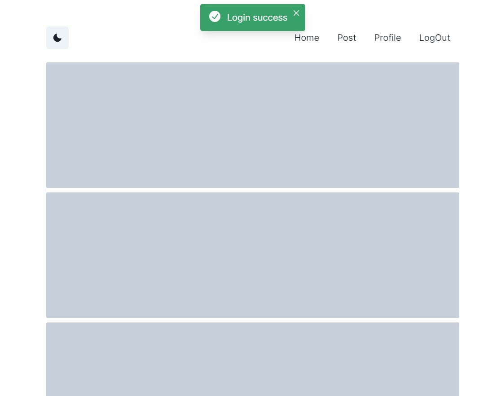
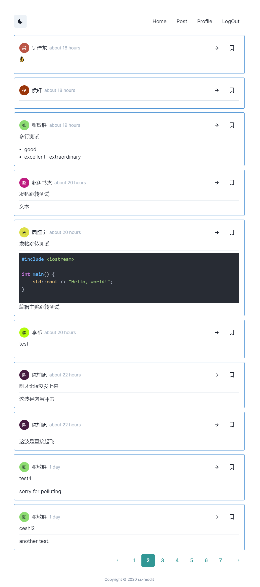
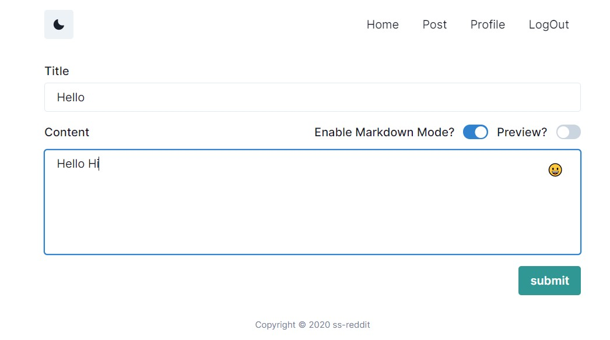
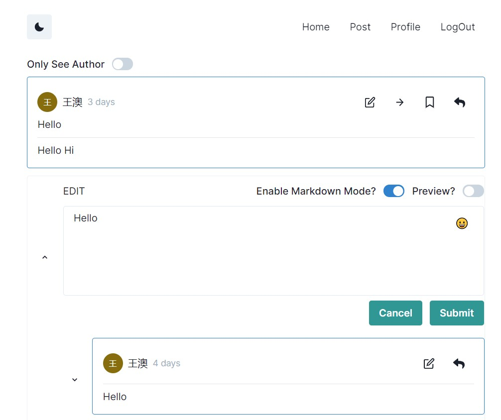
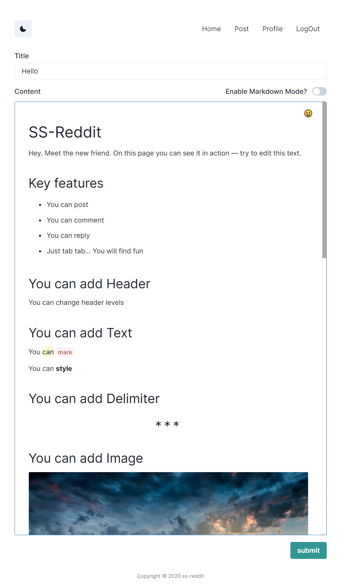
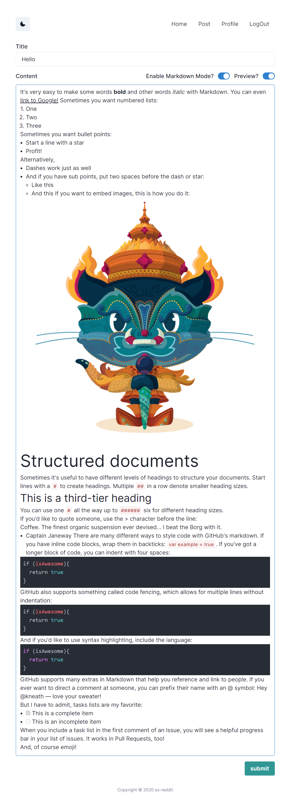
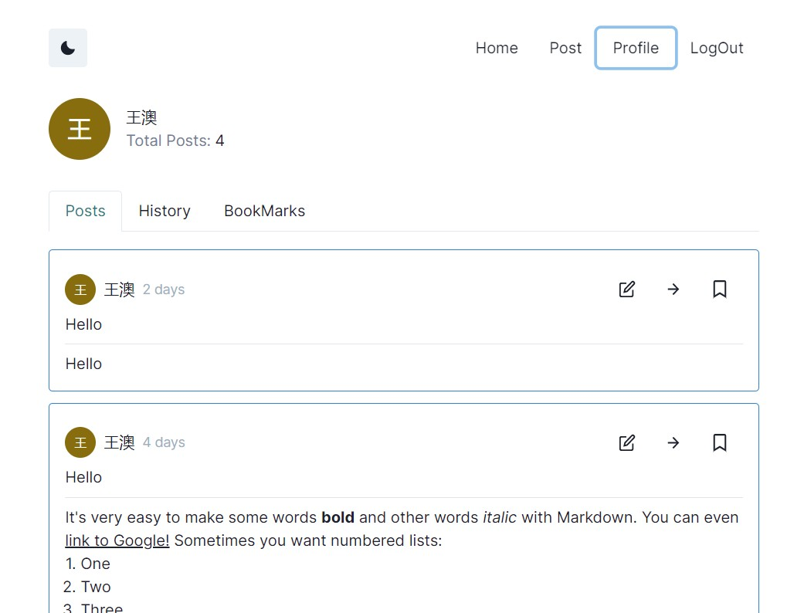

# SS-Reddit

> production deploy: https://ss-reddit.vercel.app/

## 实验说明

项目使用`create-react-app`初始化项目，使用`chakra-ui`作为 UI 库，使用`@reach/router`进行路由管理，使用`react-query`以及`fetch`进行接口请求，使用`editorjs`支持富文本编辑，使用`remark`支持`markdown`编辑，同时支持富文本和`markdown`渲染展示帖子，使用`localStorage`实现持久化登录

## 开发说明

```bash
# install dependencies
yarn

# develop
# 为方便评测，在develop中将分页大小均设为了1，方便评测分页功能
yarn start

# build
yarn build

# lint
yarn lint
```

## 功能实现

> 说明：点击帖子右上方的编辑按钮可以编辑自己发过的帖子或者回帖，点击右侧的收藏按钮可以收藏该帖子，点击右侧的回复按钮可对该帖子或者回帖进行回复，所有展示帖子列表页面均有分页

### `Login`路由进行登录

> 可点击登录后 Header 中的`LogOut`进行登出

#### 登录页面 `/login`


#### 登录成功页面



#### 登录失败页面


### `Home`首页浏览帖子列表 `/`



### 帖子详情页 `/post/:id`

> 点击帖子右侧的进入箭头可查看帖子详情页，帖子回复显示采用`Reddit`楼中楼的设计
> 可以切换上方的`Only See Author`来实现是否只看楼主


#### 编辑帖子页面 `/edit/:id`



#### 回复帖子页面

> 回复帖子或者嵌套帖子可在富文本模式和`markdown`模式间切换


#### 回复嵌套帖子


#### 编辑已回复帖子



### `Post`路由进行发帖 `/edit`

发帖可以采用富文本编辑模式或者`markdown`编辑模式

#### 富文本编辑模式



#### `markdown`编辑模式

##### `markdown`编辑


##### `markdown`预览



### `Profile`用户详情页面 `/user/:id`

> 点击帖子左上方发帖人的头像或者名字可以进入发帖人详情页,用户详情页面`Posts Tab`显示用户发过的所有帖子，`History Tab`显示用户浏览过的帖子，`BookMarks Tab`显示用户收藏过的帖子，只有用户本人可以查看`History Tab`和`BookMarks Tab`



### 登录凭证过期页面


### 编辑无权限页面

> 编辑他人帖子会自动跳回该帖子详情页


### 网络错误或其他错误页面


## 功能亮点

- 实现了富文本编辑以及`markdown`编辑模式，同时富文本编辑模式支持嵌入，比如`codepen.io`，`youtube`等(可通过直接粘贴链接实现嵌入)，支持通过上传本地文件、粘贴图片链接，拖拽文件等方式输入图片，支持`Todo checkList`，支持添加`table`，`code`以及`link`等，输入时可使用 tab 键添加相应输入块；`markdown`编辑模式支持`GitHub Flavored Markdown Spec`
- UI 支持`dark`和`light`两种主题

## 样例

### `Markdown`模式帖子样例 URL

http://localhost:3000/post/10
https://ss-reddit.vercel.app/post/10

### 富文本模式帖子样例 URL

http://localhost:3000/post/3
https://ss-reddit.vercel.app/post/3

### 回复帖子样例 URL

> 其中每层最后一个回帖都有嵌套回帖，共有 10 层

http://localhost:3000/post/3
https://ss-reddit.vercel.app/post/3
